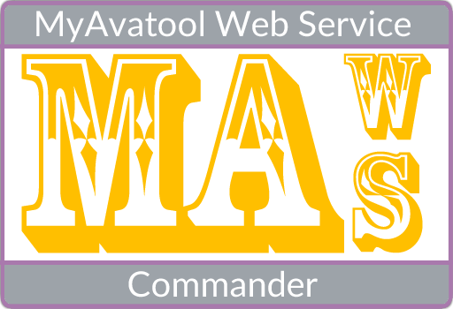

<!--
  GitHub repository template (b210103)
  https://github.com/APrettyCoolProgram/my-development-environment/tree/master/templates/github/
-->

***

<h3 align="center">

  
   

</h3>

<h3 align="center">

  &nbsp;
  &nbsp;
  &nbsp;
  &nbsp;
  &nbsp;

</h3>

<h4 align="center">

  [CHANGELOG](src/Resources/Doc/CHANGELOG.md)&nbsp;&bull;&nbsp;[ROADMAP](src/Resources/Doc/ROADMAP.md)&nbsp;&bull;&nbsp;[KNOWN ISSUES](src/Resources/Doc/KNOWN-ISSUES.md)
   

</h4>

  ## CONTENTS
  [ABOUT](#about) 
  [GETTING STARTED](#getting-started) 
  [INSTALLING](#installing) 
  [USING](#using) 
  [UPDATING](#updating) 
  [UNINSTALLING](#uninstalling) 
  [DEVELOPMENT](#development) 
  [ADDITIONAL INFORMATION](#additional-information) 

## ABOUT

MAWS Commander (MAWSC) is a command-line interface for the [**MyAvatool Web Service (MAWS)**](https://github.com/spectrum-health-systems/MAWS).

### Features

* Deploy development branches to the MAWS Staging environment.
* More things soon!

## GETTING STARTED

### Before you begin

MAWSC is a work in progress, and is being developed alongside MAWS. Currently the feature set leans heavily towards development, so it's probably not much use to end-users.

As MAWS continues to be developed, end-user features will be added to MAWSC.

### Prerequisites

* .NET 6
* A [**MAWS**](https://github.com/spectrum-health-systems/MAWS) installation

## INSTALLING

MAWSC is a portable application, so it doesn't need to be installed.

### Windows

1. Download the [latest release](https://github.com/spectrum-health-systems/MAWSC/releases) of MAWSC.
2. Extract the `MAWSC.zip` file to a directory.
3. It is recommended that you add the directory that contains MAWSC.exe to your environment path.

### Other operating systems

Currently MAWSC only supports Microsoft Windows.

## USING

MAWSC needs at least a `command` and an `action` to work.

From a console, type `MAWSC -command -action [-option]`

### Current commands and actions:

*This section will be updated as MAWSC is developed*

MAWSC can do the following:

* `MAWS -staging -deploy`: Deploy only the necessary files needed for MAWS to run in a staging environemnt.
* `MAWS -staging -deploy -full`: Deploy the entire MAWS source to a staging environemnt.

# UPDATING

Since MAWSC is portable, you just need to replace the old version with the new version.

# UNINSTALLING

Since MAWSC is portable, you just need to delete the location where Archiwizator resides.