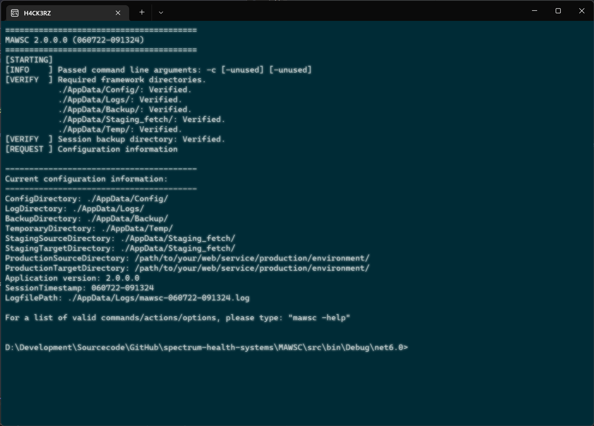

<!-- b220607.091610 -->

<div align="center">

  

</div>

<br>

<div align="center">

  
  <h3>
  Tools and utilities for custom myAvatar™ web services
  </h3>

</div>

<div align="center">

  &nbsp;
  [](https://www.apache.org/licenses/LICENSE-2.0)&nbsp;
  [](https://github.com/spectrum-health-systems/MAWSC/releases)&nbsp;
  [](https://github.com/spectrum-health-systems/MAWSC/issues)&nbsp;
  [](https://github.com/spectrum-health-systems/MAWSC/pulls)

</div>

***

<div align="center">

  

</div>

***

<div align="center">

  [](doc/CHANGELOG.md)&nbsp;&nbsp;&nbsp;[](doc/ROADMAP.md)&nbsp;&nbsp;&nbsp;[](doc/KNOWN-ISSUES.md)

</div>

***

  ### CONTENTS
  [ABOUT](#about)<br>
  [GETTING STARTED](#getting-started)<br>
  [INSTALLING](#installing)<br>
  [SETUP](#setup)<br>
  [USING](#using)<br>
  [UPDATING](#updating)<br>
  [UNINSTALLING](#uninstalling)<br>
  [DEVELOPMENT](#development)<br>
  [ADDITIONAL INFORMATION](#additional-information)<br>

***

# About

MAWS Commander (MAWSC) is a command-line interface for the [**MyAvatar Web Service (MAWS)**](https://github.com/spectrum-health-systems/MAWS), although it can be used to help maintain any custom web service for myAvatar™.

Testing web services is a tedious process that is prone to error, so I created MAWSC to take the human element out of the equation. The result is a deployment process that is faster, safer, and easily repeatable.

MAWSC is a portable application, and is easy to install and use.

## Features

* Written in .NET 6 C#, so it's cross platform (in theory)
* Displays various information about your web service environments
* Allows basic administration of your web service environments
* Automatically downloads web service sourcecode from a repository
* All session actions are backed up and logged to the console and local logfiles
* Extremely configurable

## Built with

* .NET 6

# Getting started

## Prerequisites

* .NET 6
* A [**MAWS**](https://github.com/spectrum-health-systems/MAWS) installation (or a custom web service of your own.)
* Microsoft Windows Operating System

## Before you begin

MAWSC is developed and tested on Windows 10 and Windows Server XXXX.

While MAWSC is (in theory) cross-platform, it has not been tested on non-Windows Operating Systems.

## Initial setup

Before you use MAWSC, you will need to:
1. [Install MAWSC](#installing)
2. [Configure MAWSC](#configuring)

### Installing

MAWSC is a portable application, so it doesn't need to be installed. Just follow these steps:
1. Download the [latest release]() of MAWSC
2. Extract the "mawsc-release-X-x-x-x.zip to a directory of your choosing

If you add the directory where you installed MAWSC to your environment path, you can execute MAWSC from anywhere. Otherwise, you will need to be in the folder that contains `MAWSC.exe`.

### Configuring

MAWSC uses an external configuration file to store settings. When you first install MAWSC, that configuration file doesn't exist.

To create it, navigate to the directory where you extracted MAWSC, and type:

```
mawsc -configuration -reset
```

This will create a configuration file named `./AppData/Config/mawsc-config.json`.

The default contents of the configuration file are:

```
{
  "SessionTimestamp": "set-at-runtime",
  "ApplicationVersion": "set-at-runtime",
  "ConfigurationDirectory": "./AppData/Config/",
  "LogDirectory": "./AppData/Logs/",
  "LogfilePath": "set-at-runtime",
  "BackupDirectory": "./AppData/Backup/",
  "SessionBackupDirectory": "set-at-runtime",
  "TemporaryDirectory": "./AppData/Temp/",
  "RepositoryName": "name-of-your-repository",
  "RepositoryBranch": "name-of-your-repository-branch",
  "RepositoryUrl": "set-at-runtime",
  "StagingFetchDirectory": "./AppData/Staging_fetch/",
  "StagingTestingDirectory": "/path/to/your/web/service/testing/environment/",
  "ProductionDirectory": "/path/to/your/web/service/production/environment/",
  "MawscCommand": "set-at-runtime",
  "MawscAction": "set-at-runtime",
  "MawscOption": "set-at-runtime"
}
```

You will need to modify the following settings for your organization. Keep in mind the repository settings use GitHub as an example, and will need to be modified if you use another version control platform.

#### RepositoryName
The name of your repository. For example, if the URL to your repository is
`https://github.com/spectrum-health-systems/MAWS`
Your `RepositoryName` would be `MAWS`


https://github.com/spectrum-health-systems/MAWS/tree/v0.60-development


* **`RepositoryBranch`**<br>
* **`StagingFetchDirectory`**<br>
* **`StagingTestingDirectory`**<br>
* **`ProductionDirectory`**<br>


## Using

### Verifying directory structure
While in developemnt MAWSC uses the following hard-coded directories:

* IIS Staging backup directory: `C:\MyAvatool\MAWS\Staging\Backup`
* IIS Staging directory: `C:\AvatoolWebService\MAWS_Staging\`
* GitHub src/: `C:\MyAvatool\MAWS\Repository\src\`
* Temporary folder: `C:\MyAvatool\Temp\`

### Commands and Actions

MAWSC needs at least a `command` and an `action` to work.

From a console, type `MAWSC -command -action [-option]`

#### Current commands and actions:

*This section will be updated as MAWSC is developed*

MAWSC can do the following:

* `MAWS -staging -deploy`: Deploy only the necessary files needed for MAWS to run in a staging environemnt.
* `MAWS -staging -deploy -full`: Deploy the entire MAWS source to a staging environemnt.

# UPDATING

Since MAWSC is portable, you just need to replace the old version with the new version.

# UNINSTALLING

Since MAWSC is portable, you just need to delete the location where Archiwizator resides.


